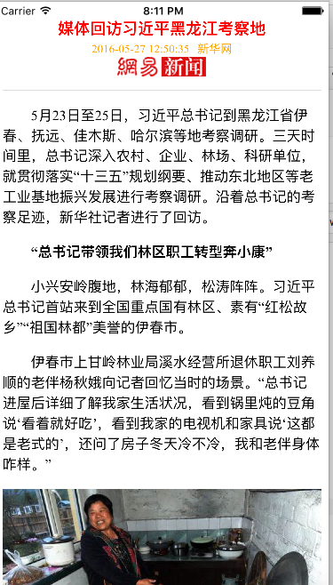
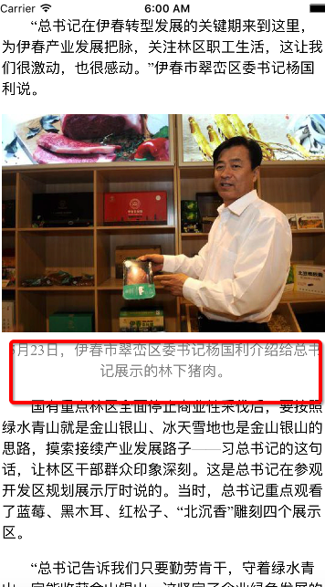

## 网易新闻详情页webview的swift-html5混合开发
 - 使用html5与swift混合开发，包含部分js／css代码，完成网易新闻web view个性化布局
```objc
Optional({
    BO2T5RF100014PRF =     {
        apps =         (
        );
        boboList =         (
        );
        body = "<p>\U3000\U30005\U670823.....大量正文的文字内容，已省略...</p>
        dkeys = "\U9ed1\U9f99\U6c5f,\U4e60\U603b\U4e66\U8bb0,\U8c03\U7814";
        docid = BO2T5RF100014PRF;
        ec = "\U9ece\U65e5\U68ee_NN5260";
        hasNext = 0;
        img =   ...<数组>
```
在上述网易新闻get请求返回的response中 ```BO2T5RF100014PRF```是一个具体新闻内容的ID,是网易新闻唯一身份识别，各个平台上都是用的是相通的ID，以下结合一则具体的新闻谈一谈h5／js/css集合swift开发综合小案例

<!--(http://github.com/yuepr/163New-swift-html5-Dome/raw/master/images-folder/xxx.png)-->

 
  - 在网易新闻URL的get1请求返回的body中有大量的空的占位<div></div>容器，而且获取到的图片信息是一个数组
  - 在加载图片时，需要根据展位容器的指定位置去加载
  
  ```objc
  extension ViewController{
    func loadDetailDataHtmlWithJsonData(jsonData:NSDictionary)->Void{
    
        let allData = jsonData["BO2T5RF100014PRF"]
        var body =  allData!["body"] as! String
        let title = allData!["title"]as! String
//        let source = allData!["source"]as!String
        let ptime = allData!["ptime"]as! String
        let source  = allData!["source"]as! String
        let image = allData!["img"]as! [[String:AnyObject]]
        
        for i in 0..<image.count{
            let imageItem = image[i]
            let ref = imageItem["ref"]as! String
            let alt = imageItem["alt"]as! String
            let src = imageItem["src"]as! String
            print(src)


        //注意，这一段代码是根据网易新闻详情页的html代码预留的空白<div>容器将指定位置的容器替换成实体照片，
//            //根据每一则新闻图文并茂的情况不同，这些预留的空白容器位置也大体不相同

//        let imgHtml = "<div class = \"img-logo\"> <div class=\"img-title\">\(alt)</div></div>"
            
           body =  body.stringByReplacingOccurrencesOfString(ref, withString: imgHtml)
        }
        let titleLogoImg = "http://img2.cache.netease.com/f2e/news/res/channel_logo/news.png";
        let titleLogoImgHtml = "<div id = \"logo\"></div>"
        // 创建CSS样式
        let css = NSBundle.mainBundle().URLForResource("newsDetail", withExtension: "css")
        let cssHtml = "<link href=\"\(css!)\" rel=\"stylesheet\" />"
        // 创建JS文件
        let js = NSBundle.mainBundle().URLForResource("newsDetail", withExtension: "js")
        let jsHtml = "<script src=\"\(js!)\"></script>"
      
        let titleHtml = "<div id=\"mainTitle\">\(title)</div>"
  //    let subTitleHtml = "<div id=\"subTitle\"><span class=\"pTime\">\(ptime)</span><span>\(source)</span>\(titleLogoImgHtml)</div>"
        
   //     let html = "<html><head>\(cssHtml)</head><body>\(titleHtml)\(subTitleHtml)\(body)\(jsHtml)</body></html>"
        
        webView.loadHTMLString(html, baseURL: nil)
    }

  ```
   
  - 在上图中图片底部的图文描述，以及第一张图片中顶部网易logo以及主标题／副标题的排版布局等都是借助css完成
  - js部分则是实现了本pro中长按屏幕打开相册的功能，自定义协议头/读取协议头
  - 本文的URL获取是通过拦截网易新闻在iOS设备上的数据请求，分析而来，所有解释权网易所有
  - 因为能力有限，如果您对我有什么优化代码的建议，欢迎交流

